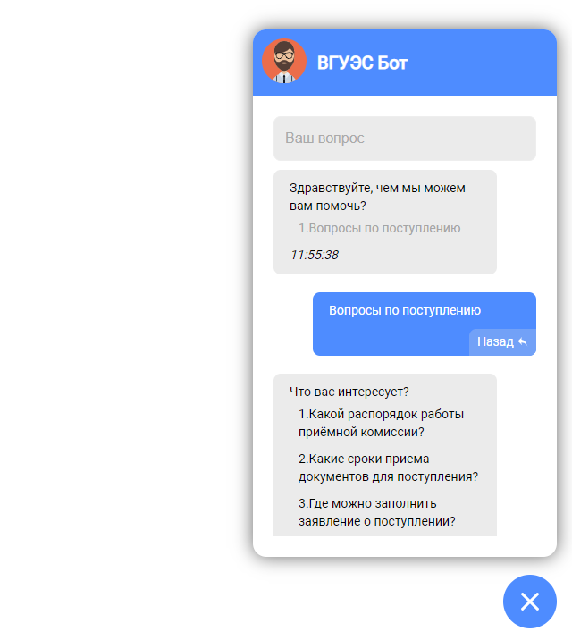

# Vue chatbot frontend

Встраиваемый интерфейс чат бота для сайта.

[](https://git.frogling.com/vvsu-chat-bot/vue-chatbot/-/commits/master)

Lasted preview [demo site](http://gentlememes.s.frogling.com/vvsu-chat-bot/vue-chatbot/)



## Project setup

```bash
yarn install
```

### Compiles and hot-reloads for development

```bash
yarn run serve
```

### Compiles and minifies for production

```bash
yarn run build
```

## Links

* [Vue config](https://cli.vuejs.org/config/)
* [Vue documentation](https://vuejs.org/v2/guide/)
* [Vue cookbook](https://vuejs.org/v2/cookbook/)
* [Chat bot documentation](http://vvsubotapi.t.frogling.com/doc/)
