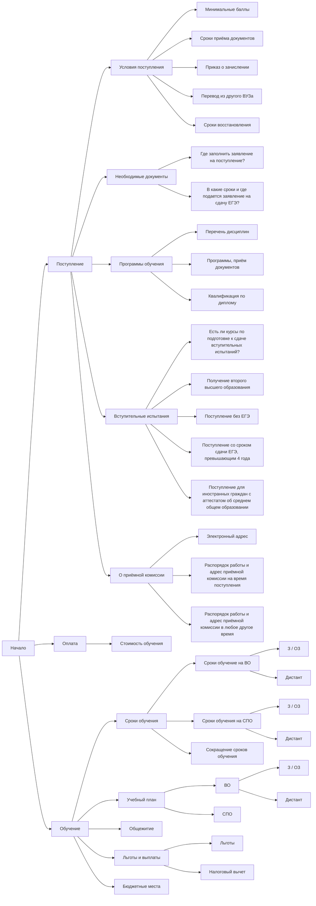

```mermaid
graph LR;
  A["Начало"]-->B["Поступление"];
  A-->C["Оплата"];
  A-->D["Обучение"];

  B-->B1["Условия поступления"];
  B-->B2["Необходимые документы"];
  B-->B3["Программы обучения"];
  B-->B4["Вступительные испытания"];
  B-->B5["О приёмной комиссии"];

  B1-->B11["Минимальные баллы"];
  B1-->B12["Сроки приёма документов"];
  B1-->B13["Приказ о зачислении"];
  B1-->B14["Перевод из другого ВУЗа"];
  B1-->B15["Сроки восстановления"];

  B2-->B21["Где заполнить заявление на поступление?"];
  B2-->B22["В какие сроки и где подается заявление на сдачу ЕГЭ?"];

  B3-->B31["Перечень дисциплин"];
  B3-->B32["Программы, приём документов"];
  B3-->B33["Квалификация по диплому"];

  B4-->B41["Есть ли курсы по подготовке к сдаче вступительных испытаний?"];
  B4-->B42["Получение второго высшего образования"];
  B4-->B43["Поступление без ЕГЭ"];
  B4-->B44["Поступление со сроком сдачи ЕГЭ, превышающим 4 года"];
  B4-->B45["Поступление для иностранных граждан с аттестатом об среднем общем образовании"];

  B5-->B51["Электронный адрес"];
  B5-->B52["Распорядок работы и адрес приёмной комиссии на время поступления"];
  B5-->B53["Распорядок работы и адрес приёмной комиссии в любое другое время"];

  C-->C1["Стоимость обучения"];
  
  D-->D1["Сроки обучения"];
  D-->D2["Учебный план"];
  D-->D3["Общежитие"];
  D-->D4["Льготы и выплаты"];
  D-->D5["Бюджетные места"];

  D1-->D11["Сроки обучение на ВО"];
  D1-->D12["Сроки обучения на СПО"];
  D1-->D13["Сокращение сроков обучения"];

  D11-->D111["З / ОЗ"];
  D11-->D112["Дистант"];

  D12-->D121["З / ОЗ"];
  D12-->D122["Дистант"];
  
  D2-->D21["ВО"];
  D2-->D22["СПО"];

  D21-->D211["З / ОЗ"];
  D21-->D212["Дистант"];

  D4-->D41["Льготы"];
  D4-->D42["Налоговый вычет"];


```
